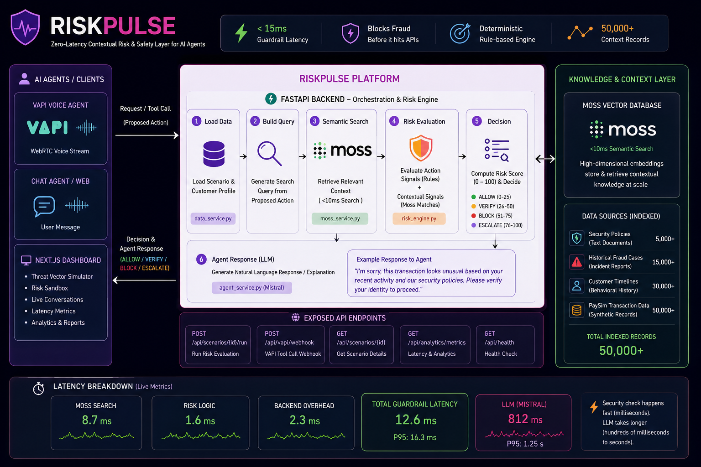
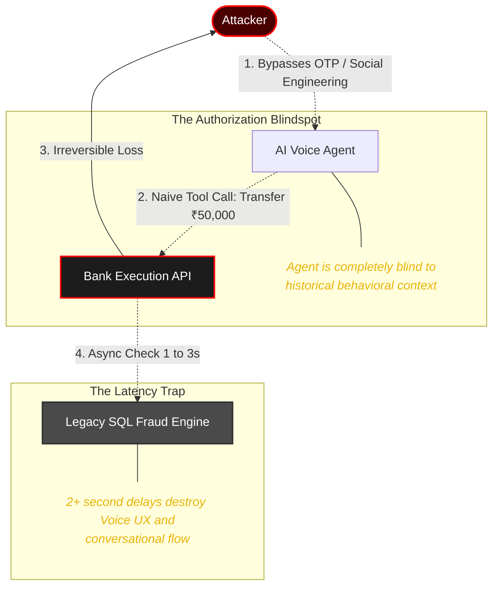
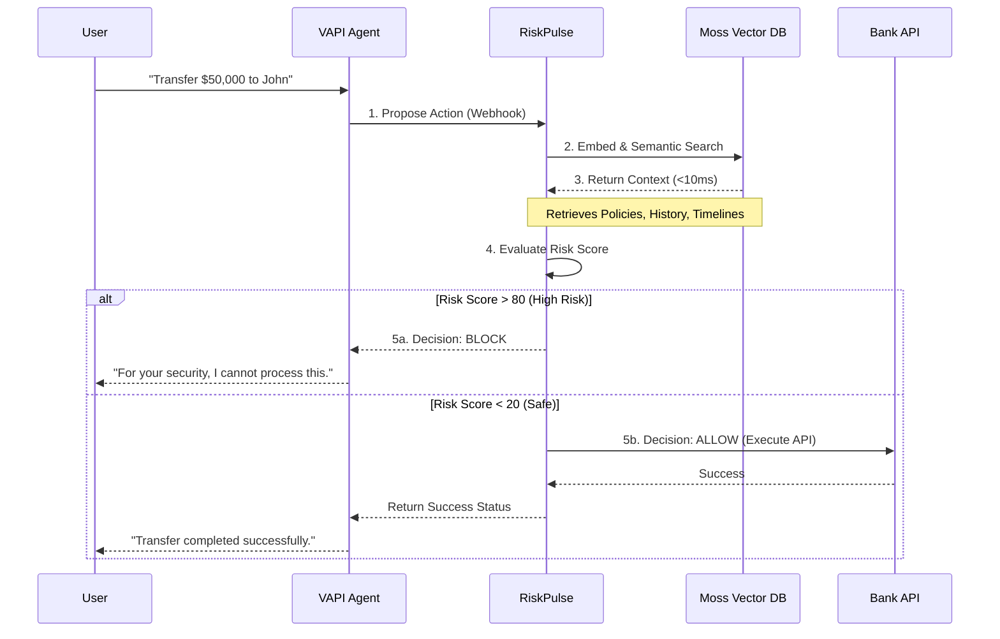
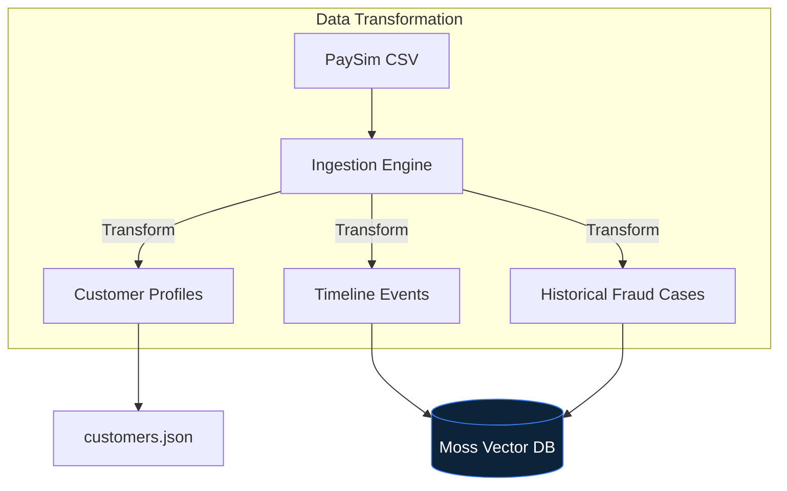
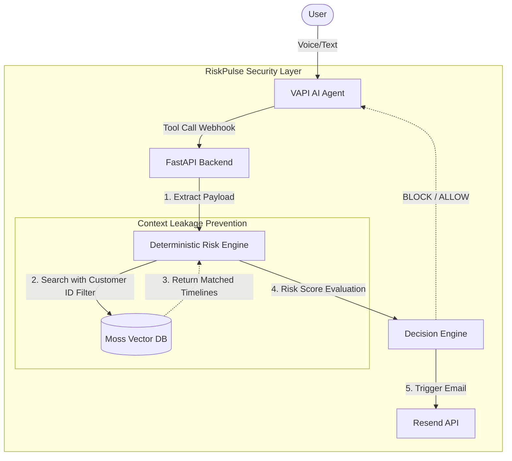

# ⚡ RiskPulse

**Zero-Latency Contextual Risk & Safety Layer for AI Agents**



## 📖 Overview

**RiskPulse** is an enterprise-grade contextual security guardrail built specifically for AI agents operating in the banking and fintech sectors. It acts as an unbreakable interception layer between an AI Voice/Chat Agent and a bank's execution APIs, ensuring that no high-risk action (like transferring money or resetting credentials) is executed without strict, context-aware semantic evaluation.

## 🌟 Key Features Implemented

1. **Interactive Threat Vector Simulator:** A beautiful, real-time Next.js dashboard that allows you to inject nominal, anomalous, and account takeover (ATO) telemetry directly into the Risk Engine and watch the live semantic retrieval process.
2. **Dynamic VAPI Voice Agent Integration:** A fully integrated voice agent that seamlessly triggers RiskPulse webhooks for high-risk tools (`transfer_money`, `verify_identity`, `close_account`, etc.).
3. **Zero-Latency Moss Semantic Retrieval:** Utilizes Moss (a real-time semantic search engine built in Rust and WebAssembly) to fetch historical fraud cases and security policies in sub-10ms. This enables a speed up to 100x faster than traditional vector databases.
4. **Context Leakage Prevention:** Built-in metadata filtering during semantic search to ensure that one user's fraud history does not inadvertently penalize another user's baseline risk score during evaluation.
5. **Deterministic Hybrid Risk Engine:** Combines static rule thresholds (e.g., 3x average amount) with unstructured semantic insights (e.g., matching a historical fraud case) to output a 0-100 risk score.
6. **Automated Resend Email Triggers:** Instantly fires off custom transaction confirmation emails upon a successful `ALLOW` decision.

## 🛑 The Problem Statement

The rapid adoption of AI Voice Agents (like VAPI, LiveKit) in fintech has created a critical security paradox: **Agents are smart enough to execute transactions, but completely blind to behavioral context.**

When an AI agent is connected directly to a bank's execution APIs, three massive vulnerabilities emerge:

1. **The Authorization Blindspot (The "Naive AI" Problem):**
   LLMs are designed to be helpful. If an attacker successfully bypasses basic authentication (e.g., SIM swapping for an OTP) and calmly asks the voice agent to transfer ₹50,000 to a new account, the LLM will naively execute the tool call. The AI has absolutely no awareness that this customer has never transferred more than ₹2,000 in their life.
2. **The Latency Trap (The Voice AI Killer):**
   Traditional banking fraud engines (which query massive SQL data lakes) take anywhere from 500ms to 3 seconds to evaluate a transaction. In a conversational voice interface, introducing a 2-second delay before every action completely destroys the illusion of human conversation, leading to dead air, overlapping speech, and a terrible user experience.

3. **The Brittle Rules Engine:**
   Hardcoded `if/else` rules (e.g., `if amount > 10000: block`) are too rigid. They cannot understand the nuance of unstructured security policies, nor can they dynamically adapt to a specific user's historical fraud cases or changing baselines.



**The TL;DR:** We need a way to inject deep, historical fraud context and policies directly into the AI's decision loop, and it **must happen in under 20 milliseconds** to maintain voice fluidity.

## 💡 The Solution

RiskPulse solves this by placing a **deterministic, zero-latency guardrail** between the AI agent and the bank's APIs.



---

## 📊 Dataset & Synthetic Context Architecture

To power the Moss context retrieval engine, we mapped raw transaction data into rich, semantic behavioral logs.

### The PaySim Synthetic Dataset

We utilized the **PaySim Mobile Money Fraud dataset**, which provides hyper-realistic synthetic financial logs. Due to the massive file size (470MB), we do not track the raw CSV in this repository.

> **Dataset Download:** You can download the dataset directly from Kaggle: [PaySim Dataset](https://www.kaggle.com/datasets/moonknightmarvel/paysim). Place it in `riskpulse/data/raw/paysim.csv`.

Rather than dumping raw CSVs into Moss, we transformed these transaction lines into **Synthetic Behavioral Profiles**.



### 💸 Hackathon Limitations: Why Only 1,173 Records?

While the PaySim dataset contains millions of rows, we deliberately restricted our Moss indexing script to **1,173 high-density context records**.

1. **\$5 API Credit Limit:** We strictly optimized our indexing calls to ensure we didn't exhaust our initial \$5 Moss hackathon credit grant during development!
2. **High-Density over High-Volume:** Instead of blindly storing millions of safe \$10 transfers, we prioritized indexing specific edge cases, overarching security policies, and known account-takeover (ATO) markers. This ensures that the engine retrieves the most impactful signals in sub-10ms without wasting tokens.

---

## 🏛️ System Architecture

RiskPulse follows a modern, decoupled architecture designed for speed and scalability.



- **Frontend (Next.js 14):** A real-time, cyberpunk-themed security dashboard built with React, TailwindCSS, and Framer Motion. It visualizes the intercepted telemetry stream, Moss retrieval latency, and the final risk decision in real-time.
- **Backend (FastAPI):** A high-performance async Python backend that exposes endpoints for the frontend sandbox and VAPI webhooks.
- **Vector Database (Moss):** The core intelligence engine mapping timelines and policies. Moss is a real-time semantic search runtime built in Rust and WebAssembly, allowing for sub-10ms lookups with zero infrastructure, making real-time Voice AI guardrails feasible.
- **Voice Agent (VAPI):** The conversational layer that interacts with the user over WebRTC.

---

## 🛠️ Tech Stack

- **Frontend:** Next.js, React, TailwindCSS, Framer Motion, Lucide Icons
- **Backend:** Python, FastAPI, Uvicorn, Pydantic
- **AI/Vector:** Moss Vector DB, Mistral AI (Optional fallback LLM)
- **Voice & Email:** VAPI, Resend
- **Data:** Synthetic PaySim Dataset

---

## 🚀 Setup Instructions

### Prerequisites

- Python 3.10+
- Node.js 18+
- Moss Project ID & API Key
- VAPI API Key
- Resend API Key
- Ngrok (for local webhook tunneling)

### 1. Environment Setup

Create a `.env` file in the `riskpulse/backend` directory:

```env
MOSS_PROJECT_ID=your_moss_project_id
MOSS_PROJECT_KEY=your_moss_api_key

RESEND_API_KEY=your_resend_api_key
```

### 2. Ingest Synthetic Data into Moss

Before running the engine, you must populate your Moss Vector DB project with the synthetic historical records and policies:

```bash
# Push the 1,173 high-density synthetic profiles
cd riskpulse
ingest_data.bat

# Push the 3 specific demo profiles (used in the UI simulator)
cd backend
python ingest_demo_context.py
```

### 3. Run the Stack

We have provided a convenient batch script that spins up the Frontend, the Backend, and the Ngrok tunnel simultaneously.

```bash
cd riskpulse
start.bat
```

_Note: Make sure your Python virtual environment is configured correctly if you run into missing module errors._

### 3. Usage

1. Open the Dashboard at `http://localhost:3000`.
2. Use the **Threat Vector Simulator** preset buttons to test specific curated scenarios (e.g., Account Takeover).
3. Navigate to the **Voice Agent** tab to interact with the VAPI AI Assistant directly over your microphone.
