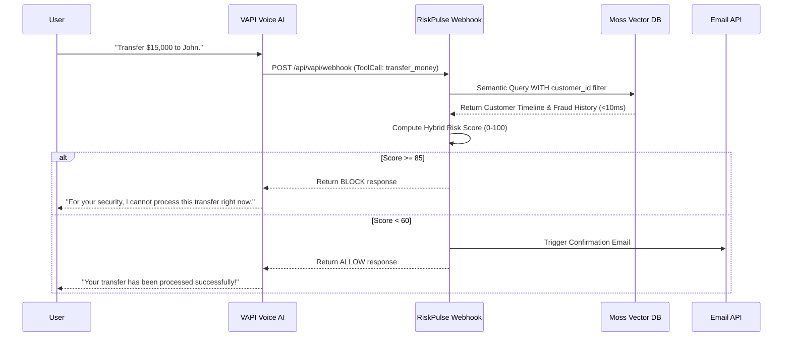
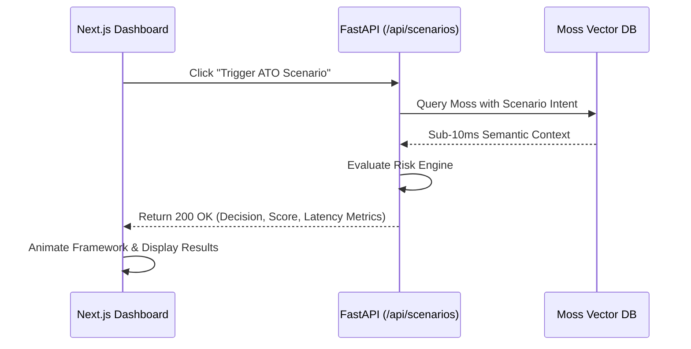

# Architecture Deep Dive - RiskPulse

RiskPulse follows a modern, decoupled architecture designed for extreme speed (sub-10ms evaluations) and high scalability, leveraging Moss as a zero-latency semantic retrieval engine.

---

## 🏗️ 1. Component Responsibilities

### Frontend (Next.js 14)
- **Role:** Security Operations Dashboard & Threat Vector Simulator.
- **Responsibilities:**
  - **Threat Simulator:** Allows security teams to inject synthetic telemetry (Nominal, Anomalous, ATO) directly into the Risk Engine via the `/api/scenarios/{id}/run` endpoint.
  - **Voice UI:** Integrates the VAPI Web SDK for real-time microphone interactions with the AI assistant.
  - **Visualizations:** Renders live latency metrics (Moss vs. Risk Logic) and the final Risk Score (0-100) using Framer Motion animations.

### Backend (FastAPI)
- **Role:** Orchestrator, Webhook Receiver, and Hybrid Risk Engine.
- **Responsibilities:**
  - **VAPI Webhooks:** Exposes `/api/vapi/webhook` to catch high-risk tool calls (`transfer_money`, etc.) before they reach execution.
  - **Semantic Retrieval (`moss_service.py`):** Queries Moss using the requested action and strictly enforces Context Leakage Prevention via `customer_id` filters.
  - **Hybrid Risk Engine (`risk_engine.py`):** Computes a deterministic Risk Score combining static thresholds (e.g., amount > 10,000) and semantic insights (e.g., historical ATO cases).
  - **Email Triggers (`email_service.py`):** Fires confirmation receipts via Resend when a transaction is `ALLOW`ed.

### Vector Database (Moss)
- **Role:** Contextual Knowledge Retrieval (Zero-Latency Guardrail).
- **Responsibilities:**
  - Built in Rust/WASM, acting as a sub-10ms local or edge semantic search runtime.
  - Stores 1,173 synthetic high-density behavioral profiles (Timelines, Policies, Fraud Cases).

### Third-Party Services
- **VAPI:** Conversational Voice AI layer. Handles WebRTC, speech-to-text, LLM routing, and structured tool calling.
- **Resend:** Transactional email API for alerting the customer upon successful tool execution.

---

## 🧠 2. Core Mechanisms

### Context Leakage Prevention (Metadata Filtering)
Vector databases inherently perform *global* semantic searches. Without filtering, a query like "Is this transfer safe?" might retrieve a fraud case from *another* customer, unfairly penalizing the current user.
**The Fix:** RiskPulse intercepts the `customer_id` from the VAPI tool call and passes it as a strict metadata filter into Moss. 
```python
results = await client.query(
    INDEX_NAME, 
    search_query, 
    limit=3, 
    filters={"customer_id": customer_id} # PREVENTS LEAKAGE
)
```

### The Hybrid Risk Engine (0-100 Score)
We do not rely solely on an LLM or solely on hardcoded rules. We use a hybrid, deterministic scoring system:
1. **Base Score (0):** Every transaction starts at 0.
2. **Rule-Based Penalties:** `if amount > 3x average: +25 score`.
3. **Semantic Penalties:** If Moss retrieves a past `Account Takeover` case matching the current timeline context: `+50 score`.
4. **Decision:** 
   - `>= 85`: **BLOCK**
   - `>= 60`: **VERIFY (OTP)**
   - `< 60`: **ALLOW**

---

## 🔄 3. Data Flows

### Flow A: VAPI Voice Agent Execution (Live Webhook)
This is the primary flow when a user talks to the AI Agent over the phone.



### Flow B: Threat Vector Simulator (Dashboard Sandbox)
This flow powers the Next.js UI allowing developers to visually test specific fraud scenarios.



---

## ⏱️ 4. Latency Measurement Methodology

We use Python's `time.perf_counter()` to measure the precise execution time of the guardrail:
- **Moss Search Latency:** Time taken purely for `client.query()` execution against the Rust/WASM engine.
- **Risk Logic Latency:** Time taken by the deterministic Python risk evaluation loop (regex, JSON parsing, arithmetic).
- **Total Guardrail Latency:** Moss Latency + Risk Logic Latency.

By ensuring the Total Guardrail Latency remains under 20ms, we guarantee that the security interception happens so quickly that the VAPI Voice Agent does not pause, maintaining perfect conversational fluidity.
